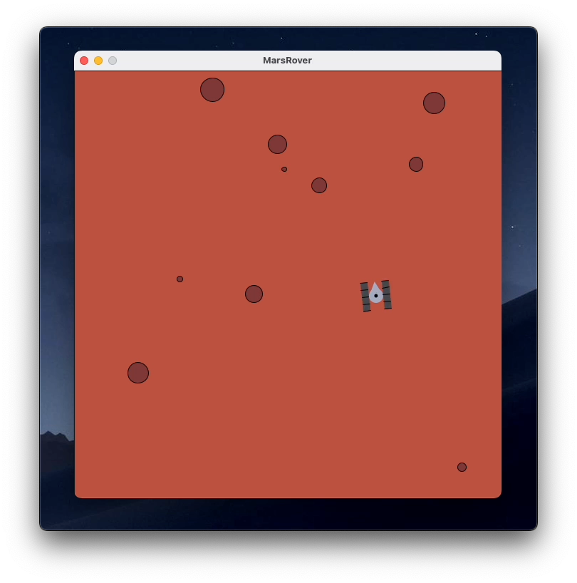

# Mars Rover

Re-interepretation of the Mars Rover Kata, just for fun.

## How to play with it

- Download the latest version of Processing from https://processing.org
- Clone this repo
- Open the `MarsRover.pde` file
- Hit the Play button

## Notes

> Wait, there are no tests in this project!

Yeah, I know... For some reason, unit testing is not a first-class citizen in the Processing world. Feel free to open a PR if you know how to do it!
