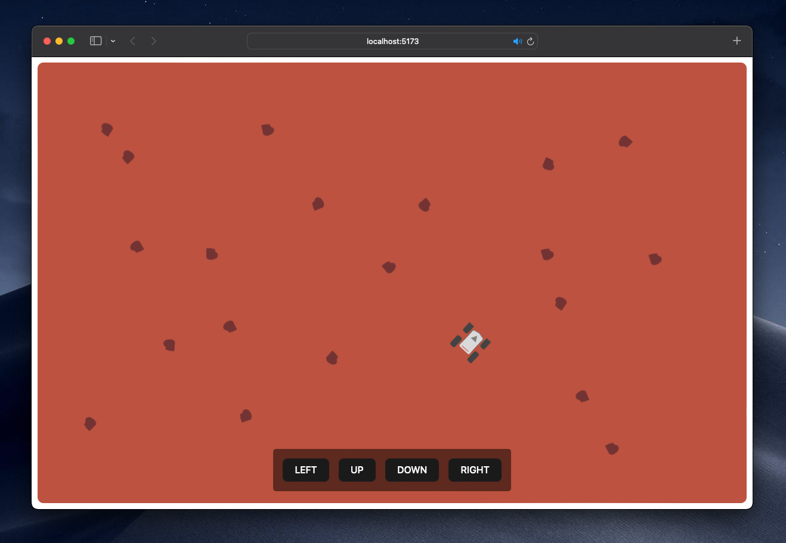

# Mars Rover Reactive

Hi there!

This is a reactive backend for the Mars Rovers Kata, using WebSockets. Because, why not? :)



## How to run

The project includes a Gradle wrapper. To run the service locally, execute the following command from the root folder:

```shell
./gradlew bootRun
```

Then, go to the [frontend](../Vuejs) project and follow the instructions if you want to play around with the Rover.

To run the backend tests:

```shell
./gradlew clean test
```
