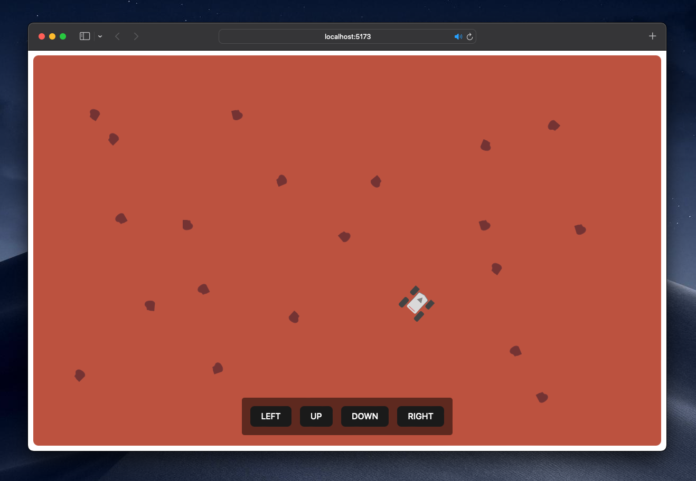

# Mars Rover UI

This is the frontend for the Mars Rovers Kata, using WebSockets and VueJS.



## How to run

The `package.json` contains some scripts to run this project. You can use NPM, Yarn, Bun, or whatever you prefer to execute them.

First, make sure the [backend API](../Reactor) is up and running:

```shell
bun run api

or

npm run api
```

Then, execute a `run dev` to start the frontend:

```shell
bun run dev

or

npm run dev
```

Then, go to http://localhost:5173 to start playing around with the Rover. Open multiple windows if you want another Rover to play with.
